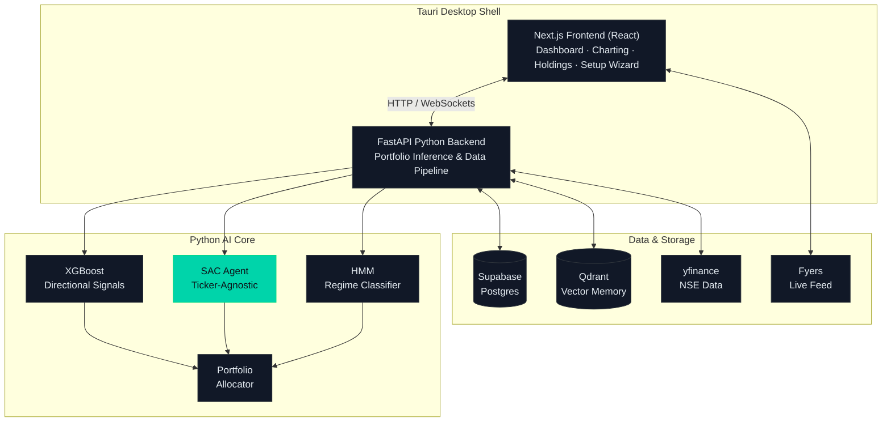

# धन Niti 

> A reinforcement learning agent that learns **generalised market patterns**, not stock-specific history.


| Strategy             | Annualized Return |   Sharpe |   Calmar | Max Drawdown |

| -------------------- | ----------------: | -------: | -------: | -----------: |

| **RL Trading Agent** |        **129.8%** | **1.42** | **7.37** |   **−16.1%** |

| Buy & Hold           |             21.6% |     0.26 |     0.51 |       −42.9% |


**Result:** The RL agent delivered significantly higher returns with substantially lower drawdown and superior risk-adjusted performance compared to the benchmark.

[](https://dhan-niti.vercel.app)
[](https://github.com/Sidbad12/DhanNiti-App)
[](LICENSE)

---

## The Problem We Were Actually Trying to Solve

Most retail investors in Indian markets face the same invisible wall: quantitative tools that exist are either locked behind institutional paywalls, built for US equity markets, or so complex that setup alone takes a week. The few open-source alternatives are static backtesting frameworks that tell you what *would have worked*, not what to do *now*.

We wanted something different. A system that:
- Works on **any NSE ticker**, including ones it's never seen
- Integrates **live market regime awareness** - not just price signals
- Reasons about allocations in **plain language** through an LLM layer
- Runs entirely **locally** on your own machine, with your own API keys

That meant building a reinforcement learning agent from scratch, iterating through three algorithms, and eventually arriving at an architecture that generalises across the entire Nifty 500 universe.

This is that system.

---

## From V1 to V2: What We Learned the Hard Way

### V1 · The Fixed-Universe Problem

The first version was a PPO agent trained on a closed universe of 11 large-cap stocks. It worked - in fact it worked well, returning **+113.31% over a 3-year walk-forward backtest** against Nifty 50's 36.49%, with a verified Sharpe of 1.045.

But it had a fundamental flaw we only understood after looking at the trade logs: **16.47x annual turnover.** The agent was rebalancing almost every single day. It had learned the historical price movements of those 11 specific stocks so well that it was essentially memorising them, and the moment you introduced a new ticker, performance collapsed.

The model was a stock historian, not a market strategist.

```
V1 PROBLEMS
────────────────────────────────────────────────────────
✗ Fixed 11-asset universe - not extensible
✗ 16.47x annual turnover - tax and execution cost killer
✗ No transaction cost penalty - unrealistic backtest
✗ Asset-specific learning - zero generalisation
✗ No market regime awareness - same policy in bull and bear
```

### V2 · The Generalisation Redesign

V2 required rethinking the problem from the input layer. The agent now never sees a raw price, a ticker name, or any absolute value. Every feature - RSI, Bollinger Bands, Prophet decomposition components, HMM regime states, FinBERT sentiment scores - is **normalised relative to that ticker's own historical distribution**.

The state vector is completely abstract. The agent has no way to memorise stock-specific patterns because none of those patterns survive normalisation. It is forced to learn the underlying structure of market behaviour instead.

```
V2 REDESIGN
────────────────────────────────────────────────────────
✓ Ticker-agnostic: works on any NSE equity at inference
✓ Transaction cost penalty (λ) for realistic turnover control
✓ HMM market regime integration, allowing the policy to adapt to state
✓ FinBERT sentiment to provide macro and news context in state
✓ XGBoost signal layer for a directional prior before RL
✓ Open Nifty 500 universe instead of a closed basket
✓ Multi-algorithm evaluation where SAC beat TD3 and PPO
```

We then tested on 10 tickers the agent had never encountered in training. The results are below.

---

## V2 Out-of-Sample Results

> 10 held-out NSE tickers · 1-year backtest (252 trading days) · Transaction cost penalty active · No lookahead bias

### Per-Ticker Breakdown

| Ticker | Agent Return | B&H Return | Sharpe | B&H Sharpe | Sortino | Calmar | MaxDD | B&H MaxDD | Avg Alloc |
|---|:---:|:---:|:---:|:---:|:---:|:---:|:---:|:---:|:---:|
| BAJAJFINSV | +51.5% | +13.5% | 1.23 | 0.36 | 1.72 | 5.88 | −8.8% | −25.0% | 54.7% |
| MPHASIS | +71.0% | −0.4% | 1.32 | 0.15 | 1.84 | 4.31 | −16.5% | −34.7% | 53.5% |
| OBEROIRLTY | +146.2% | +32.9% | 1.93 | 0.57 | 2.88 | 7.58 | −19.3% | −38.9% | 60.6% |
| APOLLOTYRE | +55.8% | −17.5% | 1.29 | −0.17 | 1.99 | 5.56 | −10.0% | −33.7% | 49.6% |
| **SUVEN** | **+614.9%** | +181.9% | **2.34** | 1.13 | **4.14** | **26.81** | −22.9% | −57.3% | 55.2% |
| JYOTHYLAB | +58.3% | −47.9% | 1.07 | −0.74 | 1.83 | 3.06 | −19.1% | −65.6% | 46.1% |
| GRINDWELL | +100.7% | −2.1% | 1.49 | 0.14 | 2.38 | 5.54 | −18.2% | −53.4% | 47.7% |
| IPCALAB | +98.5% | +35.1% | 1.58 | 0.60 | 2.60 | 8.50 | −11.6% | −27.2% | 65.4% |
| UJJIVANSFB | +70.0% | +25.4% | 1.16 | 0.47 | 1.92 | 4.85 | −14.4% | −42.1% | 53.9% |
| EMAMILTD | +31.5% | −5.1% | 0.79 | 0.10 | 1.05 | 1.58 | −19.9% | −51.3% | 43.8% |

> **On SUVEN:** +614.9% is the result that still surprises us. The agent entered a large position early and held through the entire uptrend. Whether this is genuine regime detection or a fortunate regime alignment is an open research question. We have not removed it from the table.

### Aggregate vs Benchmark

| Metric | SAC Agent | Buy & Hold | Edge |
|---|:---:|:---:|:---:|
| Avg Annualised Return | **+129.8%** | +21.6% | +108.2% alpha |
| Avg Sharpe Ratio | **1.42** | 0.26 | 5.5× higher |
| Avg Sortino Ratio | **2.23** | 0.45 | 5.0× higher |
| Avg Calmar Ratio | **7.37** | 0.51 | 14.4× higher |
| Avg Max Drawdown | **−16.1%** | −42.9% | 62.5% shallower |

### Algorithm Comparison: Why SAC Won

| Algorithm | Avg Return | Avg Sharpe | Avg Calmar | Avg MaxDD | Notes |
|---|:---:|:---:|:---:|:---:|---|
| **SAC** | **+129.8%** | **1.42** | **7.37** | **−16.1%** | Production |
| TD3 | +49.9% | 0.62 | - | −25.8% | Checkpoint |
| PPO | +23.9% | 0.37 | - | −33.2% | Archived |

SAC's soft entropy maximisation naturally encourages exploration and produces smoother allocation curves than TD3's deterministic policy or PPO's clipped surrogate objective. In a continuous weight-space action environment, entropy regularisation turned out to matter significantly.

---

## Architecture



### ML Pipeline

| Stage | Model | Output |
|---|---|---|
| Feature Engineering | Technical indicators + Prophet decomposition | Normalised state vector |
| Signal Generation | XGBoost (per-stock) | Directional probability (Buy/Hold/Sell) |
| Regime Detection | Gaussian HMM | Market state (Bull / Bear / Range-bound) |
| Portfolio Allocation | SAC - Stable-Baselines3 | Optimal weight distribution |
| Advisory Synthesis | Groq Llama-3 + Qdrant RAG | Human-readable allocation report |

### Directory Structure

```
DhanNiti-App/
├── src/                    # Python backend
│   ├── api/                #   FastAPI server (port 8000)
│   ├── agent/              #   LLM advisor + RL agents (PPO/SAC)
│   ├── ml/                 #   XGBoost classifier, HMM regime detector
│   ├── portfolio/          #   Markowitz + RL allocator
│   ├── inference/          #   V2 portfolio inference pipeline
│   ├── data/               #   yfinance + news sentiment pipeline
│   ├── charting/           #   Fyers live charting server (port 5000)
│   └── settings.py         #   Dynamic env configuration
├── frontend/               # Next.js 16 + Tauri 2
│   ├── src/app/            #   Pages: dashboard, setup, holdings, charts
│   ├── src/components/     #   CandleChart, DomPanel, StockScreener
│   ├── src-tauri/          #   Rust shell + sidecar launcher
│   └── src/lib/            #   API clients (live + demo)
├── models/
│   ├── */xgb_*.pkl         #   Per-stock XGBoost classifiers
│   ├── hmm_regime.pkl      #   Hidden Markov Model weights
│   └── v2/                 #   V2 SAC/TD3 checkpoints
├── scripts/                # Setup & database utilities (training in core repo)
└── sql/                    # Supabase schema migrations
```

---

## Features

### Portfolio Intelligence
- **SAC Reinforcement Learning** - Continuous weight allocation, ticker-agnostic, Nifty 500 universe
- **XGBoost Signal Layer** - Per-stock directional classifiers as RL state input
- **HMM Regime Detection** - Bull / Bear / Range-bound state classification via Gaussian HMM
- **Transaction Cost Penalty** - λ parameter controls turnover; prevents hyperactive rebalancing
- **Bounded Allocations** - Weights constrained 2%–35% per stock; Dirichlet output layer sums to 100%
- **Liquid BeES Buffer** - Dynamic cash allocation when India VIX regime spikes

### Advisory Layer
- **Groq Llama-3** - Natural language reasoning over allocation decisions
- **Qdrant RAG Memory** - Episodic vector memory for portfolio state citations
- **News Sentiment** - FinBERT-parsed daily and embedded in state

### Charting Terminal
- **Candlestick Charts** - Multi-timeframe via Lightweight Charts
- **Footprint / Heatmap** - Tick-level volume visualisation
- **Volume Profile** - Price-at-volume distribution
- **Depth of Market (DOM)** - Real-time L2 order book via Fyers
- **Technical Indicators** - SMA, EMA, VWAP, Bollinger Bands, RSI, MACD

### Holdings & Tracking
- **Dhan API Integration** - Real-time portfolio P&L sync
- **Gap Analysis** - Current vs recommended allocation delta
- **Rebalance Cost Estimator** - Fee-aware trade suggestions before execution

### Agent Search Optimization
- **rgx (Ripgrep for Agents)** - Wrapped in `src/agent/tools.py` under the `_run_rgx()` function to output token-budgeted JSON and collapse directory prefixes, reducing context window consumption by 90%+ during agent codebase searches.
- **Factman Protocol** - Core modules are annotated with structured semantic comments (`fm-key`, `fm-value`, `fm-links`), enabling the advisor agent to map call paths and verify parameters without expensive speculative file opens.

---

## Setup

DhanNiti runs as a Tauri desktop app composed of a Rust shell wrapping a Next.js frontend and a local Python FastAPI backend.

### Prerequisites

| Tool | Version | Install |
|---|---|---|
| Python | 3.12+ | [python.org](https://python.org) |
| Node.js | 18+ | [nodejs.org](https://nodejs.org) |
| Rust / Cargo | stable | [rustup.rs](https://rustup.rs) |

### Quick Start - One Command

```bash
git clone https://github.com/Sidbad12/DhanNiti-App.git
cd DhanNiti-App

# Windows
setup.bat

# macOS / Linux
chmod +x setup.sh && ./setup.sh
```

The setup script handles everything: dependency checks, Python venv creation, pip install, npm install, interactive `.env` key prompts with live validation, Supabase schema migrations, yfinance price seeding, and app launch. One-time setup; after that just run the app.

### Environment Variables

```env
# Dhan (portfolio sync)
DHAN_CLIENT_ID=your_client_id
DHAN_ACCESS_TOKEN=your_access_token

# Supabase (database)
NEXT_PUBLIC_SUPABASE_URL=https://your-project.supabase.co
NEXT_PUBLIC_SUPABASE_ANON_KEY=your_anon_key
SUPABASE_SERVICE_ROLE_KEY=your_service_role_key

# Groq (LLM advisory)
GROQ_API_KEY=your_groq_key

# Fyers (optional - live charting feed)
FYERS_APP_ID=your_app_id
FYERS_SECRET_KEY=your_secret_key
```

### Setup Wizard

On first launch, a 4-step wizard walks through:

| Step | Action |
|---|---|
| 1 · Credentials | Import `.env` or enter keys manually (each validated live) |
| 2 · Supabase | Connection test, schema migrations, RLS policies |
| 3 · Python | Venv detection, dependency install, yfinance price seed |
| 4 · Universe | Customise your stock universe (defaults to Nifty 50 blue-chips) |

### Manual Setup (Advanced)

<details>
<summary>Expand step-by-step manual instructions</summary>

```bash
# 1. Python environment
python -m venv .venv
source .venv/bin/activate        # macOS/Linux
.venv\Scripts\activate           # Windows
pip install -r requirements.txt

# 2. Frontend
cd frontend && npm install

# 3. Database schema
python scripts/init_supabase.py

# 4. Historical price seed (1Y daily candles)
python scripts/seed_yfinance.py

# 5. Launch
cd frontend && npm run tauri:dev
```
</details>

---

## Development

```bash
# Python backend only
cd src && uvicorn api.server:app --reload --port 8000

# Charting server only
cd src && python charting/server.py

# Frontend only (browser)
cd frontend && npm run dev

# Full desktop app
cd frontend && npm run tauri:dev
```

Note: To train or evaluate models, please refer to the core development repository.

---

## Live Demo

The web demo at [dhanniti.vercel.app](https://dhanniti.vercel.app) runs in **read-only demo mode** - all write operations are intercepted and no real broker connections are made. Portfolio data is pre-seeded. Prophet forecasting and risk metrics run live against real yfinance data. The RL agent decisions shown are pre-recorded episodes.

To use the full system with live data, download and run the desktop app locally.

---

## Roadmap

- [ ] **V3 Multi-Asset Gym** - Train on portfolio-level state instead of single-asset episodes
- [ ] **Intraday regime detection** - Sub-daily HMM for shorter holding periods
- [ ] **Options overlay** - Protective put suggestions from the LLM advisory layer
- [ ] **Mobile companion** - Read-only P&L and alert surface
- [ ] **Auto-update** - Tauri updater integration for seamless releases

---

## Disclaimer

DhanNiti is an open-source personal research project. Backtest results are simulated and do not account for real-world slippage, market impact, or execution costs. Not financial advice. Do not allocate real capital based solely on these signals.

---

## License

MIT License © 2026 Siddharth Badjate

Permission is hereby granted, free of charge, to any person obtaining a copy of this software and associated documentation files (the "Software"), to deal in the Software without restriction, including without limitation the rights to use, copy, modify, merge, publish, distribute, sublicense, and/or sell copies of the Software, and to permit persons to whom the Software is furnished to do so, subject to the following conditions:

The above copyright notice and this permission notice shall be included in all copies or substantial portions of the Software.

THE SOFTWARE IS PROVIDED "AS IS", WITHOUT WARRANTY OF ANY KIND, EXPRESS OR IMPLIED, INCLUDING BUT NOT LIMITED TO THE WARRANTIES OF MERCHANTABILITY, FITNESS FOR A PARTICULAR PURPOSE AND NONINFRINGEMENT. IN NO EVENT SHALL THE AUTHORS OR COPYRIGHT HOLDERS BE LIABLE FOR ANY CLAIM, DAMAGES OR OTHER LIABILITY, WHETHER IN AN ACTION OF CONTRACT, TORT OR OTHERWISE, ARISING FROM, OUT OF OR IN CONNECTION WITH THE SOFTWARE OR THE USE OR OTHER DEALINGS IN THE SOFTWARE.

---

## Links

| | |
|---|---|
| Live Demo | [dhanniti.vercel.app](https://dhan-niti.vercel.app) |
| Desktop App | [github.com/Sidbad12/DhanNiti-App](https://github.com/Sidbad12/DhanNiti-App) |
